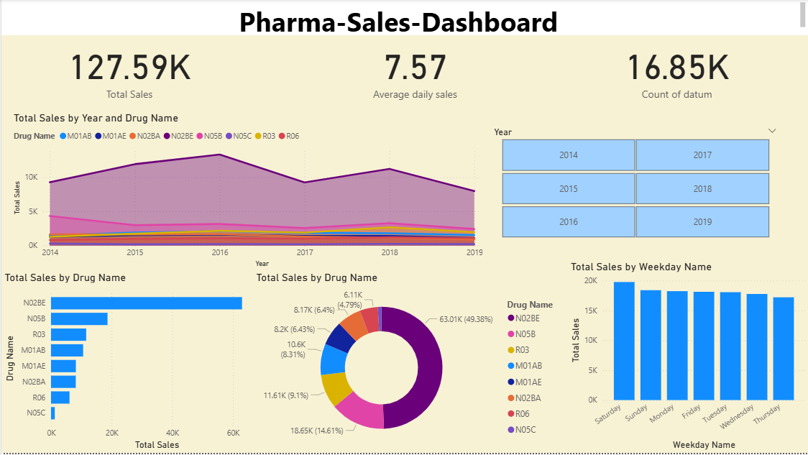

# 💊 Pharma Sales Dashboard

## 📌 Overview
An interactive Power BI dashboard analyzing pharmaceutical drug sales across 8 drug categories from 2014 to 2019.

## 📊 Visuals Built
- KPI Cards — Total Sales, Average Daily Sales, Count of Records
- Bar Chart — Sales by Drug Category
- Area Chart — Sales trend by Year
- Donut Chart — Drug sales share %
- Column Chart — Sales by Weekday
- Year Slicer — Interactive filter

## 🔍 Key Insights
- N02BE (Paracetamol) accounts for nearly 50% of all drug sales
- N05B (Anxiolytics) is the 2nd highest selling drug category
- N05C (Sleeping pills) has near-zero sales
- Sales peaked around 2017-2018 then declined slightly
- Saturday shows highest sales
  
## 🛠️ Tools Used
- Microsoft Power BI Desktop
- Power Query (for data transformation)
- DAX (for measures)

## 📁 Dataset
Daily pharmaceutical drug sales data with 8 ATC drug categories.
Source: [Kaggle — Pharmacy Sales Dataset](https://www.kaggle.com/datasets/milanzdravkovic/pharma-sales-data)

## 🖼️ Dashboard Preview

